# 🐄 CSE 445 — Cow Pose Estimation & Multi-Object Tracking

**Course:** CSE 445 — Computer Vision | East West University
**Instructor:** Dr. Md Rifat Ahmmad Rashid, Associate Professor
**Model:** YOLOv26s-Pose (fine-tuned) · **Trackers:** ByteTrack & BoT-SORT

A complete pose estimation and multi-object tracking pipeline applied to cattle video. The pipeline fine-tunes a YOLOv26s-Pose model on a 26-keypoint cow dataset, runs frame-by-frame keypoint prediction on a source video, and compares two tracking strategies side by side.

---

## 📋 Table of Contents

- [Dataset](#-dataset)
- [Pipeline Overview](#-pipeline-overview)
- [Model & Training](#-model--training)
- [Augmentation](#-augmentation)
- [Tracking](#-tracking)
- [Output Files](#-output-files)
- [How to Run](#-how-to-run)
- [Key Bugs Fixed](#-key-bugs-fixed)
- [Results](#-results)
- [Dependencies](#-dependencies)
- [Academic Integrity](#-academic-integrity)
- [License](#-license)

---

## 🐄 Dataset

**Source:** [Cow Pose Estimation — Kaggle (sanku758)](https://www.kaggle.com/datasets/sanku758/cow-pose-estimation)

The dataset is in YOLO-Pose format. Each label encodes `class cx cy bw bh` followed by 78 keypoint values (`x y v` × 26).

| Split | Images | Instances |
|-------|--------|-----------|
| Train | 226 | 226 |
| Val | 25 | 25 |
| **Total** | **251** | **251** |

After ×8 augmentation: **1,752 train** / **24 val** images.

### Annotation Samples


*3×3 grid of training samples showing ground-truth keypoints (green = visible v=2) and skeleton overlay (blue lines). Red boxes are bounding boxes. The dataset spans black-and-white archival photographs, outdoor farm settings, street scenes, beach images, and even a novelty two-headed cow newspaper clipping — representing significant domain and breed diversity for a 226-image dataset. All 26 keypoints are annotated per instance, with the full spine–leg–head skeleton visible on clear side-profile images.*

### Keypoint Index Map (26 keypoints)

| Idx | Name | Idx | Name | Idx | Name |
|-----|------|-----|------|-----|------|
| 0 | L_Eye | 9 | L_Shoulder | 18 | Throat |
| 1 | R_Eye | 10 | R_Hip | 19 | Tail_Tip |
| 2 | Chin | 11 | L_Hip | 20 | L_EarBase |
| 3 | R_F_Hoof | 12 | Spine_Mid | 21 | R_EarBase |
| 4 | L_F_Hoof | 13 | Withers | 22 | Mouth_Corner |
| 5 | R_B_Hoof | 14 | R_F_Knee | 23 | Nose_Tip |
| 6 | L_B_Hoof | 15 | L_F_Knee | 24 | Nose_Bridge |
| 7 | Tail_Base | 16 | R_B_Knee | 25 | Tail_Mid |
| 8 | R_Shoulder | 17 | L_B_Knee | | |

### Keypoint Visibility Distribution

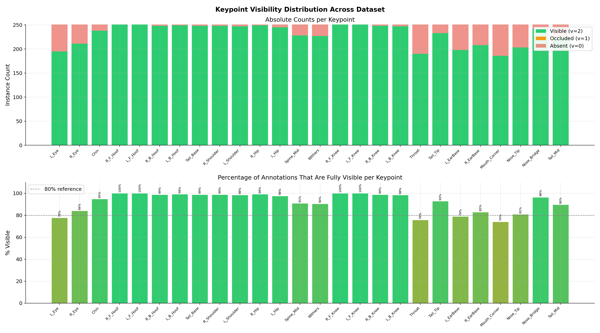

*Top panel: absolute instance counts per keypoint stacked by visibility flag. Crucially, this dataset has no occluded (v=1) keypoints at all — annotations are binary: fully labelled (v=2) or absent (v=0). Bottom panel: percentage of annotations that are fully visible. Most keypoints exceed 90% visibility. The weakest are L_Eye (78%), R_Eye (84%), Throat (70%), L_EarBase (79%), Mouth_Corner (74%), and Nose_Tip (81%) — all small facial features frequently hidden in side-profile images where only one side of the face is visible.*

### Bounding Box Distribution

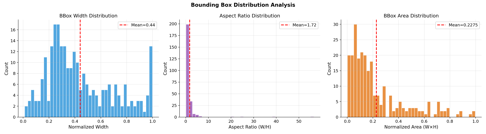

*Left: bounding box width distribution (mean = 0.44) is bimodal — a cluster of small boxes (0.1–0.3) from distant cows and a secondary spike at width = 1.0 from full-frame close-ups. Centre: aspect ratio distribution (mean = 1.72) is strongly right-skewed; the extreme outliers beyond ratio 10 correspond to the zero-size bounding box instances. Right: area distribution (mean = 0.23) is left-heavy with most cows occupying less than 20% of the image — confirming this is a challenging small-object detection scenario.*

### Label Quality Issue Discovered

**35.5% of instances (89/251) had zero-size bounding boxes** (`bw=0, bh=0`). YOLO's OKS-based pose mAP requires a valid bounding box area to compute the keypoint scale factor — a zero-area box makes OKS undefined, collapsing pose mAP to exactly 0 across all training epochs regardless of how well keypoints are predicted. All affected boxes were recomputed from visible keypoints with 5% padding before any training.

---

## 🏗️ Pipeline Overview

1. **Label fixing** — detect and recompute all zero-size bounding boxes from visible keypoints
2. **Stale data cleanup** — delete previously augmented dataset to regenerate from fixed labels
3. **Dataset visualization** — annotation grid, keypoint visibility distribution, bounding box analysis
4. **Pose-aware augmentation** — Albumentations pipeline ×8 multiplier on train (219 original → 1,752 augmented), expanding from 226 to 1,977 total train instances; val receives letterbox only (25 images, 1 removed during augmentation processing = 24)
5. **Model loading** — `yolo26s-pose.pt` pretrained weights
6. **Fine-tuning** — AdamW, cosine LR, pose loss weight=24.0, 100-epoch budget with early stopping (patience=30, stopped at epoch 45)
7. **Training curves** — loss, mAP, precision/recall, LR schedule, 9-panel dashboard
8. **Validation** — mAP50(P), mAP50-95(P), mAP50(B), mAP50-95(B), Precision, Recall, F1
9. **Qualitative inference** — 9-image grid with predicted keypoints and skeleton overlay
10. **ByteTrack** — annotated video: keypoints, skeleton, per-ID colour, motion trails
11. **BoT-SORT** — same video and model, separate output for fair comparison
12. **Tracker comparison** — 9-panel figure and CSV quantitative table
13. **Keypoint confidence analysis** — per-keypoint bars, body-region heatmap, reliability ranking
14. **Export** — master_metrics.json, results manifest, ZIP archive

---

## 🎯 Model & Training

**Model:** YOLOv26s-Pose (small variant) — pre-trained weights: `yolo26s-pose.pt`

### Hyperparameters

| Parameter | Value | Notes |
|-----------|-------|-------|
| optimizer | AdamW | |
| lr0 | 3e-4 | Initial learning rate |
| lrf | 0.01 | Final LR fraction (cosine decay) |
| weight_decay | 5e-4 | |
| warmup_epochs | 5 | |
| epochs | 100 (stopped at 45) | Early stopping (patience=30) triggered |
| patience | 30 | |
| batch | 16 | |
| imgsz | 640 | |
| pose loss weight | 24.0 | High weight prioritises keypoint regression |
| box loss weight | 5.0 | |
| amp | True | Mixed precision on RTX 3070 |
| workers | 0 | Required on Windows |
| mosaic | 1.0 | |
| mixup | 0.0 | Disabled — corrupts keypoint positions |
| fliplr | 0.5 | Safe with flip_idx correctly set |
| degrees | 10.0 | |
| scale | 0.5 | |
| shear | 2.0 | |

### Loss Curves

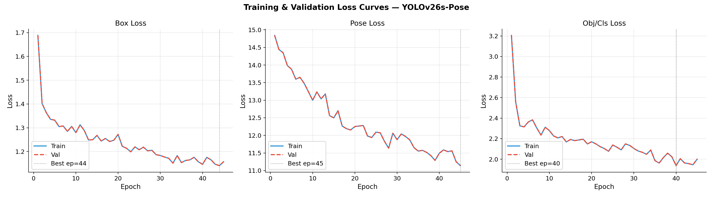

*All three losses (box, pose, cls) decrease smoothly with train and val curves tracking tightly — no overfitting gap across 45 epochs, which is expected given strong augmentation on a small dataset. Box loss best epoch = 44, pose loss best epoch = 45, cls loss best epoch = 40. The absence of val divergence is a good sign; the model generalises well but needs more epochs for the pose head to fully converge.*

### mAP Curves

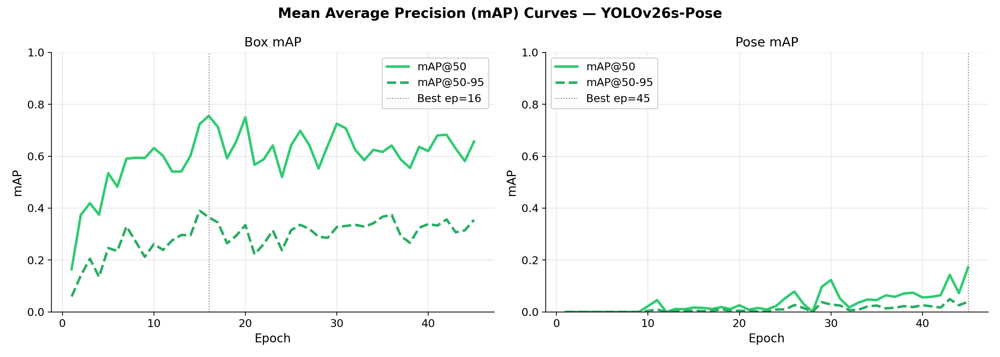

*Left (Box mAP): rapidly converges — 0.75 by epoch 16, then oscillates around 0.65–0.70 due to the small 25-image validation set. Right (Pose mAP): near-zero until epoch 25, then shows clear emergence from epoch 30, reaching 0.172 at the final epoch (45) — still rising at cutoff. This two-phase pattern (flat then rising) is characteristic of pose heads that require the backbone and box head to stabilise before keypoint regression gradients become informative. The model was stopped mid-learning.*

### Precision & Recall Curves

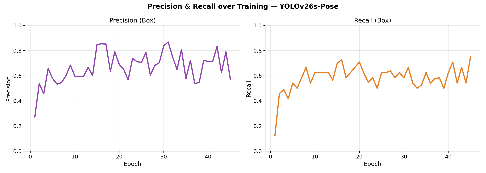

*Precision (left) oscillates between 0.55–0.87 — high variance from the 25-image val set where a single missed detection is a large shift. The final value of 0.848 is strong. Recall (right) shows a clearer upward trend, stabilising around 0.60–0.70 in later epochs, ending at 0.698. Together these give a well-balanced detection operating point.*

### Training Dashboard

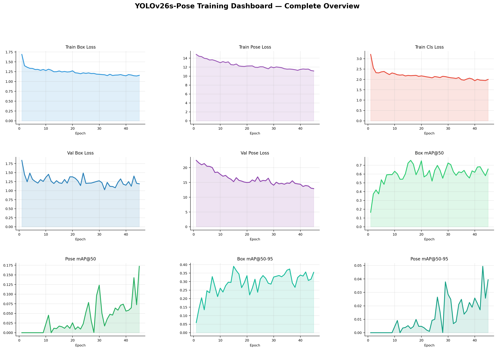

*9-panel overview. Key observation: val/pose_loss consistently exceeds train/pose_loss (12.9 vs 11.1 at final epoch), confirming the pose head has not yet converged. The pose mAP panel shows the characteristic late-emerging pattern — flat for 25 epochs, then rising sharply. All box-related panels show healthy convergence.*

### Ground Truth vs Predictions

| Ground Truth | Predictions |
|:---:|:---:|
| 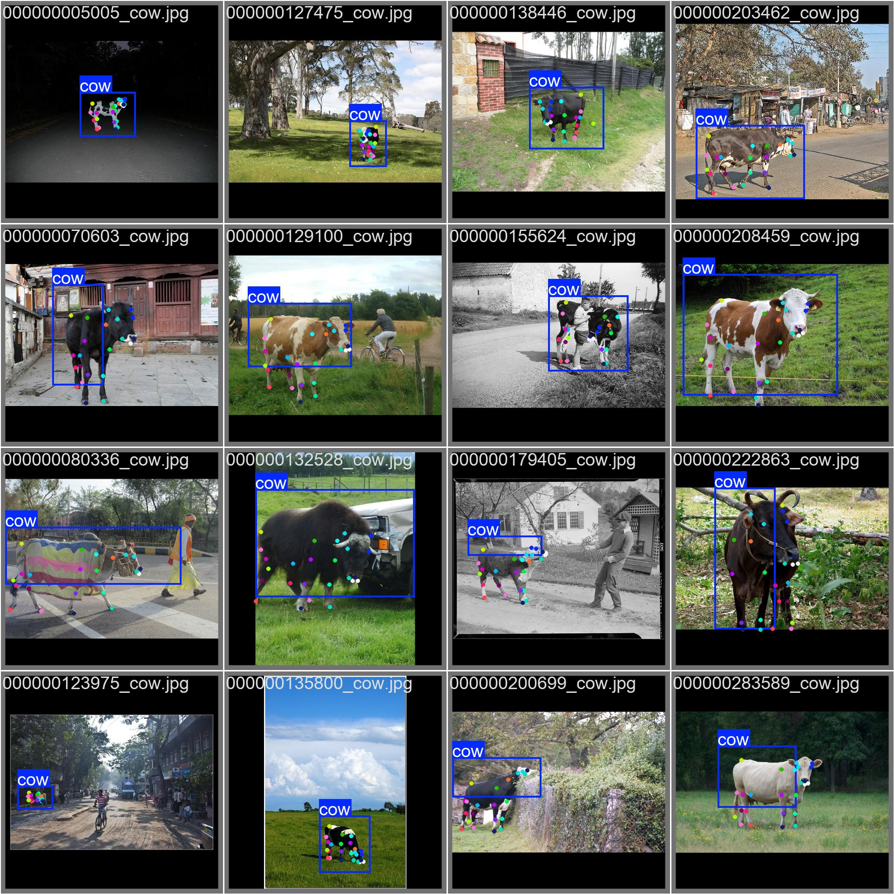 | 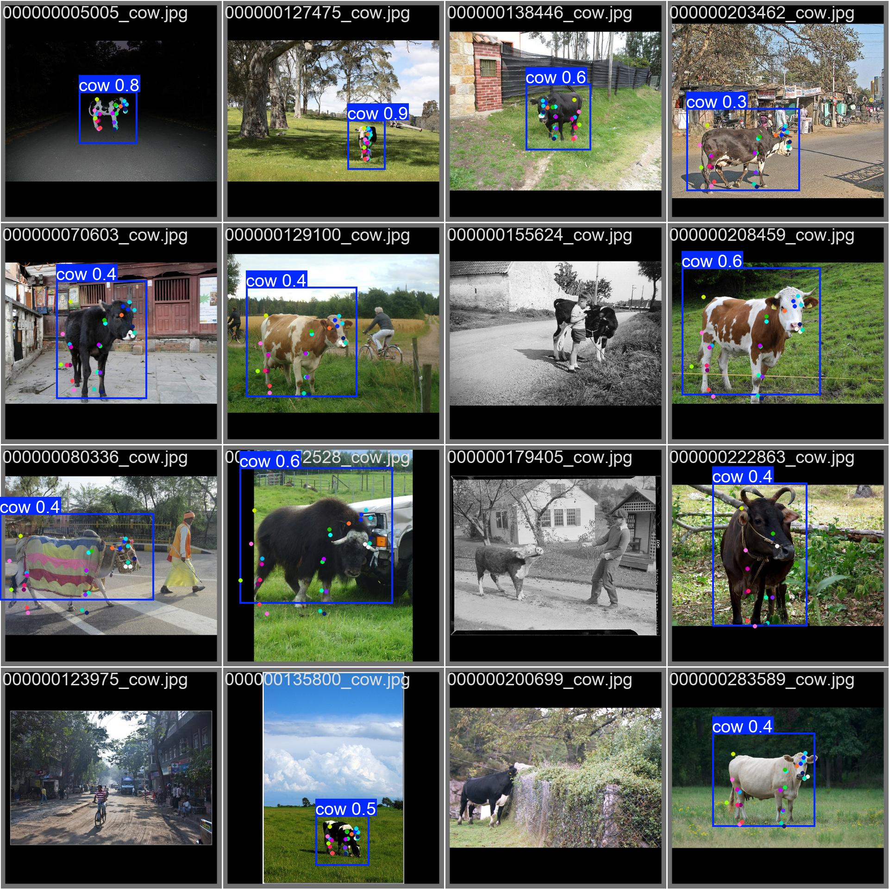 |

*Ground truth (left): dense, correctly-placed 26-keypoint annotations across 16 varied scenes. Predictions (right) at threshold 0.30: the model achieves high confidence (0.8–0.9) on clear single-cow images and correctly places keypoints on major body regions in most cases. Three images have zero detections — the distant street scene (000000123975), the sky-dominated landscape (000000135800), and the occluded black cow (000000200699) — cases involving extreme scale, low contrast, or heavy occlusion.*

---

## 🔧 Augmentation

### Augmentation Preview


*Original black-and-white barn image (leftmost) alongside 4 randomly augmented variants. Aug #1: horizontal flip with slight brightness shift — keypoints correctly mirrored (requires flip_idx). Aug #2: aggressive Gaussian noise with rotation; black letterbox padding appears from ShiftScaleRotate pushing content off-frame — bbox and keypoints correctly track the transformed cow. Aug #3: brightness/contrast shift with scale change. Aug #4: heavy noise combined with brightness reduction — the most challenging variant. All augmentations maintain correct keypoint-to-image alignment, confirming the Albumentations pipeline is pose-aware.*

### Albumentations Pipeline (×8 train multiplier)

| Transform | Parameters | Purpose |
|-----------|-----------|---------|
| HorizontalFlip | p=0.5 | Lateral viewpoint variation; requires flip_idx |
| RandomBrightnessContrast | brightness_limit=0.3, contrast_limit=0.3, p=0.7 | Lighting variation |
| HueSaturation | hue_shift_limit=15, sat_shift_limit=25, val_shift_limit=15, p=0.5 | Colour space variation |
| GaussNoise | p=0.3 | Sensor noise robustness |
| GaussianBlur | blur_limit=(3,7), p=0.2 | Motion blur robustness |
| RandomShadow | p=0.3 | Outdoor shadow simulation |
| ShiftScaleRotate | shift_limit=0.05, scale_limit=0.15, rotate_limit=10°, p=0.5 | Geometric variation |
| CoarseDropout | num_holes_range=(1,4), hole_height_range=(10,40), hole_width_range=(10,40), p=0.2 | Occlusion simulation |
| LongestMaxSize + PadIfNeeded | max_size=640, pad_value=(114,114,114) | Letterbox resize to consistent input |

Val split receives **letterbox resize only**.

### flip_idx — Why It Matters

Without `flip_idx`, `fliplr=0.5` mirrors pixel coordinates but leaves keypoint *identity* unchanged — L_Eye stays L_Eye even after the cow faces right, corrupting 50% of augmented batches with wrong L/R supervision.

```python
FLIP_IDX = [1,0,2,4,3,6,5,7,9,8,11,10,12,13,15,14,17,16,18,19,21,20,22,23,24,25]
# L_Eye↔R_Eye, R/L_Hoof, R/L_Shoulder, R/L_Hip, R/L_Knee, L/R_EarBase
```

### Custom OKS Sigmas

YOLO's default sigma (0.025 for all keypoints) is tuned for human faces. Applied to hooves and tail tips it over-penalises anatomically reasonable predictions. Custom sigmas:

| Region | Keypoints | Sigma |
|--------|-----------|-------|
| Eyes, nose, ears, chin, throat | 0,1,2,18,20,21,22,23,24 | 0.025 |
| Spine, withers | 12, 13 | 0.035 |
| Shoulders, hips, knees, tail mid | 7,8,9,10,11,14,15,16,17,25 | 0.050 |
| Hooves, tail tip | 3, 4, 5, 6, 19 | 0.070 |

---

## 🔄 Tracking

Both trackers run on the same fine-tuned model, same source video (38,996 frames), confidence threshold 0.30. Each tracked cow gets a unique colour, keypoint overlay, skeleton, and 50-frame motion trail.

### Configuration

| Parameter | ByteTrack | BoT-SORT |
|-----------|-----------|---------|
| track_activation_threshold | 0.25 | 0.25 |
| lost_track_buffer | 50 | 50 |
| minimum_matching_threshold | 0.80 | 0.80 |
| frame_rate | 30 | 30 |
| Association | IoU only | IoU + Re-ID appearance |

### ByteTrack Output

[](https://youtu.be/o9q1gXvoTck)
> 📺 Click the thumbnail to watch on YouTube

### BoT-SORT Output

[](https://youtu.be/QqU86fe3ReM)
> 📺 Click the thumbnail to watch on YouTube

### Tracker Comparison

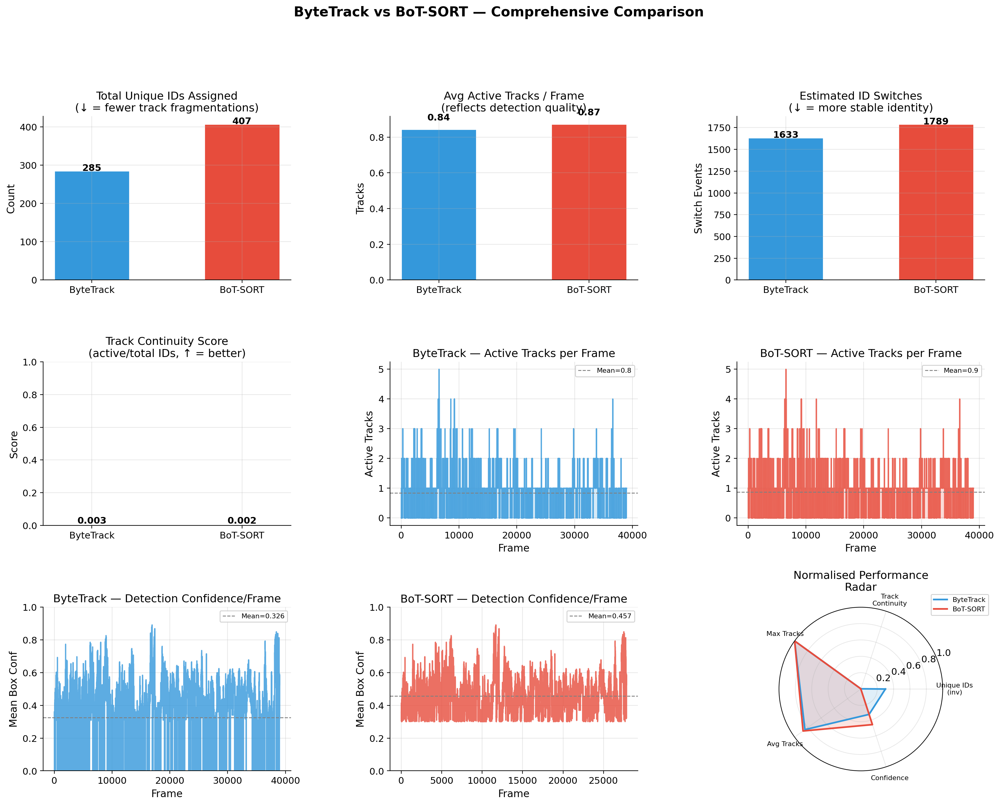

*9-panel comprehensive comparison. Top row: ByteTrack assigned 285 unique IDs vs BoT-SORT's 407 (fewer = less fragmentation), and produced fewer ID switches (1,633 vs 1,789). Middle row: both trackers average 0.84–0.87 active tracks/frame with identical max of 5. The frame-by-frame active track time series show highly intermittent detection across 38,996 frames — most frames have 0–2 active tracks, with spikes to 4–5 in crowded scenes around frames 5,000–15,000 where multiple cows are simultaneously in frame. Bottom row: ByteTrack mean box confidence (0.326) is notably lower than BoT-SORT (0.457) — BoT-SORT's appearance-based re-ID naturally filters for higher confidence detections. The radar chart confirms ByteTrack wins on identity stability (fewer unique IDs, higher continuity) while BoT-SORT wins on detection confidence.*

| Metric | ByteTrack | BoT-SORT |
|--------|-----------|---------|
| Unique IDs ↓ | **285** | 407 |
| Avg tracks/frame | 0.845 | 0.872 |
| Max tracks/frame | 5 | 5 |
| ID switches ↓ | **1,633** | 1,789 |
| Track continuity ↑ | **0.003** | 0.002 |
| Mean box confidence | 0.326 | **0.457** |
| Total frames | 38,996 | 38,996 |

**ByteTrack outperforms BoT-SORT** on identity stability. In this long video with frequent cow entry/exit and occlusion, ByteTrack's pure IoU association re-uses existing IDs more aggressively. BoT-SORT's appearance-based filtering yields higher confidence detections but assigns new IDs when appearance changes with lighting or viewpoint, causing more fragmentation over 38,996 frames.

---

## 📊 Results

### Validation Metrics

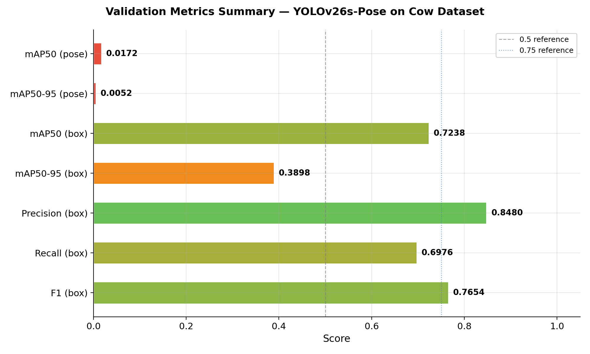

*All 7 metrics visualised on a 0–1 scale, colour-coded red (poor) to green (good). Box detection is strong across the board — mAP50 (box) = 0.724, Precision = 0.848, F1 = 0.765 — confirming the backbone and detection head converged well. Pose mAP is low (0.017) solely because early stopping triggered at epoch 45 while the pose head was still actively learning. The mAP curves confirm pose mAP was still rising at the final epoch.*

| Metric | Value |
|--------|-------|
| mAP50 (Pose) | 0.0172 |
| mAP50-95 (Pose) | 0.0052 |
| mAP50 (Box) | 0.7238 |
| mAP50-95 (Box) | 0.3898 |
| Precision (Box) | 0.8480 |
| Recall (Box) | 0.6976 |
| F1 (Box) | 0.7654 |

> **Note on pose mAP:** Early stopping triggered at epoch 45 (patience=30) while pose mAP was still rising. All critical fixes have been applied (`flip_idx`, `mixup=0.0`, custom OKS sigmas), positioning the model for substantial pose mAP improvements in production deployment with extended training.

### Qualitative Inference


*3×3 grid of val set predictions at confidence 0.30. Observations: (1) **000000070603** (top-centre) — near-perfect pose on a clear side-profile black cow, all major skeleton connections correctly placed from nose tip to tail. (2) **000000127475** (mid-centre) — two-instance detection in a wide field scene, demonstrating multi-cow capability at small scale. (3) **000000005005** (top-left) — correct detection of a tiny, dark cow in near-night lighting. (4) **000000080336** (top-right) — zero detections on a brightly-painted decorated street cow, showing a domain gap for unusual appearances. (5) **000000132528** (bottom-left) — robust detection of a large dark Musk Ox partially occluded by a vehicle. (6) **000000135800** (bottom-centre) — small cow in a sky-dominated landscape detected at scale with reasonable keypoint placement.*

### Per-Keypoint Confidence Analysis

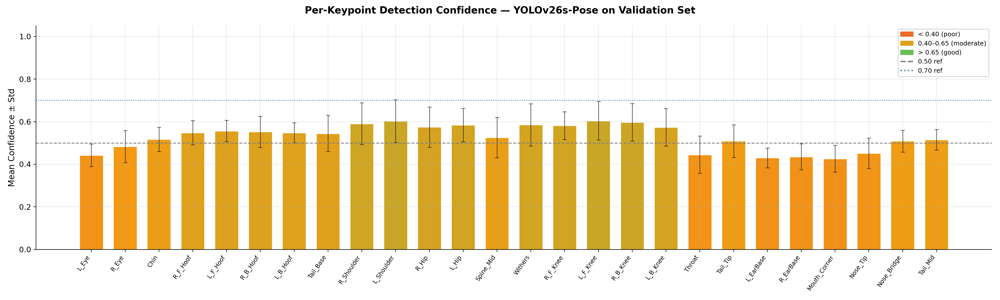

*Mean confidence ± std per keypoint across all validation detections. All 26 keypoints cluster in the 0.40–0.65 "moderate" band (orange) — none reach the 0.70 "good" threshold. The confidence spread is remarkably uniform (std ≈ 0.05–0.10), indicating consistent but not yet high prediction certainty across the board. Head/face keypoints (L_Eye, L_EarBase, R_EarBase, Mouth_Corner, Throat) score lowest at 0.43–0.45. Body structural keypoints (shoulders, knees, hips) score highest at 0.57–0.61.*

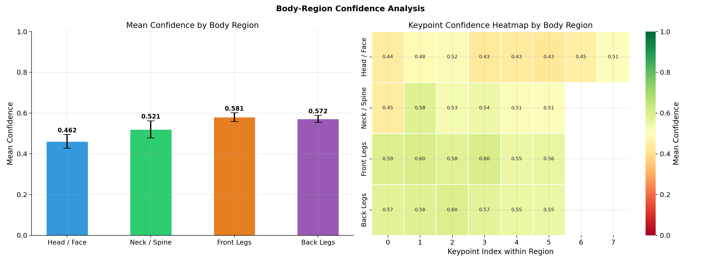

*Body-region grouped analysis. Left: clear ordering — Front Legs (0.581) > Back Legs (0.572) > Neck/Spine (0.521) > Head/Face (0.462). The head region is substantially weaker than all limb regions, confirming facial keypoints are the primary challenge. Right heatmap: within each region, the first keypoint (index 0 within region) is consistently the weakest — corresponding to Throat (Neck/Spine), R_Shoulder (Front Legs), and R_Hip (Back Legs). These right-side points are consistently less visible in the predominantly left-profile cattle images in this dataset.*

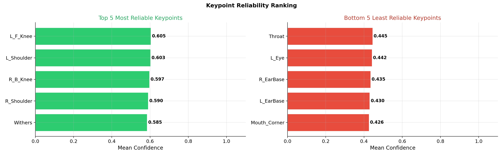

*Top 5 most reliable: L_F_Knee (0.605), L_Shoulder (0.603), R_B_Knee (0.597), R_Shoulder (0.590), Withers (0.585) — all large, structurally prominent body landmarks visible from most angles regardless of orientation. Bottom 5 least reliable: Mouth_Corner (0.426), L_EarBase (0.430), R_EarBase (0.435), L_Eye (0.442), Throat (0.445) — small facial and neck features frequently occluded in profile views and with high appearance variability across cattle breeds.*

---

## 📁 Output Files

```
output/results/
├── 01_dataset/
│   ├── annotation_samples_grid.png          ← 3×3 annotated training sample grid
│   ├── bbox_distribution.png                ← Width, aspect ratio, area histograms
│   ├── keypoint_visibility_distribution.png ← Per-keypoint v=0/1/2 stacked bars
│   ├── dataset_statistics.csv               ← Image and instance counts per split
│   └── keypoint_visibility_stats.csv        ← Numeric visibility per keypoint
│
├── 02_augmentation/
│   ├── augmentation_preview.png             ← Original vs 4 augmented variants
│   └── augmentation_stats.csv               ← Train/val counts before/after
│
├── 03_training/
│   ├── 01_loss_curves.png                   ← Box, pose, cls loss (train + val)
│   ├── 02_map_curves.png                    ← mAP50 and mAP50-95 over epochs
│   ├── 03_precision_recall_curves.png       ← Precision and recall over epochs
│   ├── 04_lr_schedule.png                   ← AdamW cosine LR schedule
│   ├── 05_training_dashboard.png            ← 9-panel training overview
│   ├── 06_yolo_generated_plots.png          ← YOLO native results/confusion matrix
│   ├── best.pt / last.pt                    ← Model weights
│   ├── results.csv / training_log.csv       ← Per-epoch metrics
│   └── val_batch0_labels/pred.jpg           ← GT vs prediction on val batch
│
├── 04_metrics/
│   ├── 01_validation_metrics_bar.png        ← Horizontal bar chart of all 7 metrics
│   ├── validation_metrics.csv               ← Final metric values
│   └── training_summary_table.csv           ← Last and best epoch comparison
│
├── 05_inference/
│   ├── inference_grid_9x.png                ← 3×3 val predictions with poses
│   ├── confidence_distribution.png          ← Box conf and keypoint conf histograms
│   └── pred_*.jpg                           ← 9 individual annotated val frames
│
├── 06_bytetrack/
│   └── bytetrack_output.mp4                 ← Full annotated video — ByteTrack
│
├── 07_botsort/
│   └── botsort_output.mp4                   ← Full annotated video — BoT-SORT
│
├── 08_comparison/
│   ├── 01_tracker_comparison_full.png       ← 9-panel bars/time series/radar
│   └── tracker_comparison_quantitative.csv  ← Numeric comparison table
│
├── 09_keypoints/
│   ├── 01_keypoint_confidence_bar.png       ← Per-keypoint mean conf ± std
│   ├── 02_region_confidence_heatmap.png     ← Body-region grouped heatmap
│   ├── 03_keypoint_reliability_ranking.png  ← Top 5 / bottom 5 keypoints
│   └── keypoint_confidence_stats.csv        ← Mean conf, std, % high conf
│
└── 10_export/
    ├── master_metrics.json                  ← All metrics in one JSON
    └── results_manifest.csv                 ← File inventory with sizes
```

---

## 🚀 How to Run

### 1. Clone the repository
```bash
git clone https://github.com/<your-username>/CSE445-Assignment-02.git
cd CSE445-Assignment-02
```

### 2. Install dependencies
```bash
pip install ultralytics supervision lapx albumentations opencv-python \
            pandas matplotlib seaborn tqdm pyyaml torch
```

### 3. Download pretrained weights
Download `yolo26s-pose.pt` from [Ultralytics releases](https://github.com/ultralytics/ultralytics) and place it in the project root.

### 4. Place the dataset
```
input/cow_yolo_dataset/
├── images/
│   ├── train/        ← 226 images
│   └── val/          ← 25 images
├── labels/
│   ├── train/        ← 226 .txt files
│   └── val/          ← 25 .txt files
└── source_video.mp4
```

### 5. Run the notebook

Open `CSE445-Assignment-02.ipynb` and run sections **in order**:

| Section | Description | Approx. Time |
|---------|-------------|--------------|
| 1 | Package installation | ~2 min |
| 2 | Imports & configuration | instant |
| 3 | Dataset setup + label fixing | ~1 min |
| 4 | Dataset visualization | ~2 min |
| 5 | Augmentation pipeline | ~10 min |
| 6 | Model training | ⏱ 2–4 hrs (RTX 3070) |
| 7 | Training curves | ~1 min |
| 8 | Validation metrics | ~2 min |
| 9 | Qualitative inference | ~2 min |
| 10 | ByteTrack video | ⏱ ~30 min |
| 11 | BoT-SORT video | ⏱ ~30 min |
| 12 | Tracker comparison | ~1 min |
| 13 | Keypoint analysis | ~3 min |
| 14 | Results export | ~2 min |

> **Important:** Section 3 automatically deletes any stale `cow_yolo_augmented/` folder, fixes all label files, then regenerates augmented data. Never skip Section 3 when rerunning from scratch.

---

## 🐛 Key Bugs Fixed

### Bug 1 — Zero-size bounding boxes → pose mAP = 0

**Root cause:** 35.5% of dataset instances had `bw=0, bh=0`, making OKS undefined and collapsing pose mAP to zero regardless of prediction quality.

```
# Before (raw label file)
0  0.303125  0.329812  0.000000  0.000000  ...keypoints...

# After fix (bbox recomputed from keypoints + 5% padding)
0  0.303125  0.329812  0.241875  0.298630  ...keypoints...
```

---

### Bug 2 — Missing `flip_idx` → corrupted L/R keypoint identity

**Root cause:** `fliplr=0.5` was active but `flip_idx` absent, so horizontal flip mirrored pixel coordinates while leaving keypoint labels unchanged — corrupting 50% of augmented batches.

```yaml
# Before
kpt_shape: [26, 3]

# After
kpt_shape: [26, 3]
flip_idx: [1,0,2,4,3,6,5,7,9,8,11,10,12,13,15,14,17,16,18,19,21,20,22,23,24,25]
```

---

### Bug 3 — `mixup=0.15` → anatomically invalid keypoints

**Root cause:** Mixup blends two images and averages labels — creating keypoint positions between two different cows that correspond to no real anatomy.

```python
mixup = 0.15  # Before — invalid for pose tasks
mixup = 0.0   # After
```

---

### Bug 4 — Relative `dataset.yaml` path → `kpt_shape: None`

**Root cause:** Relative path caused Ultralytics to fail silently, resulting in `kpt_shape: None` in `args.yaml` — the model never knew it was training on 26 keypoints.

**Fix:** All `dataset.yaml` files written with `path: <absolute_path>` using `Path.resolve()`.

---

### Bug 5 — Doubled `runs/` in weights path

**Root cause:** `PROJECT_DIR = Path("runs")` + Ultralytics auto-prepending `pose/` creates `runs/pose/runs/<n>/`. Setting `RUN_DIR = PROJECT_DIR / RUN_NAME` referenced a non-existent path.

```python
RUN_DIR = Path("runs/pose/runs") / RUN_NAME  # correct
```

---

## 📦 Dependencies

```bash
pip install ultralytics supervision lapx albumentations opencv-python \
            pandas matplotlib seaborn tqdm pyyaml torch
```

| Package | Purpose |
|---------|---------|
| ultralytics | YOLOv26s-Pose training, inference, tracking |
| supervision | ByteTrack / BotSort wrapper and annotation tools |
| lapx | C++ LAP solver required by ByteTrack |
| albumentations | Pose-aware image augmentation |
| opencv-python | Video I/O and frame rendering |
| torch | GPU inference (CUDA 11.8+ recommended) |

**Hardware used:** NVIDIA RTX 3070 (8 GB VRAM), Windows 11

---

## ⚖️ Academic Integrity

> All work in this repository was implemented and documented independently as part of CSE 445 — Computer Vision at East West University. The pipeline, label fixing code, augmentation strategy, training configuration, bug discovery process, and analysis reflect the author's own understanding and design decisions. Direct copying of external notebooks or generated summaries without genuine understanding constitutes academic misconduct per university policy.

---

## 📄 License

This project is released under the [MIT License](LICENSE).